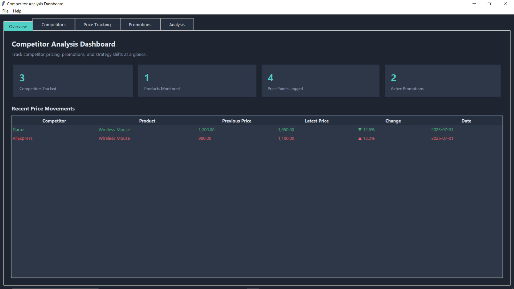
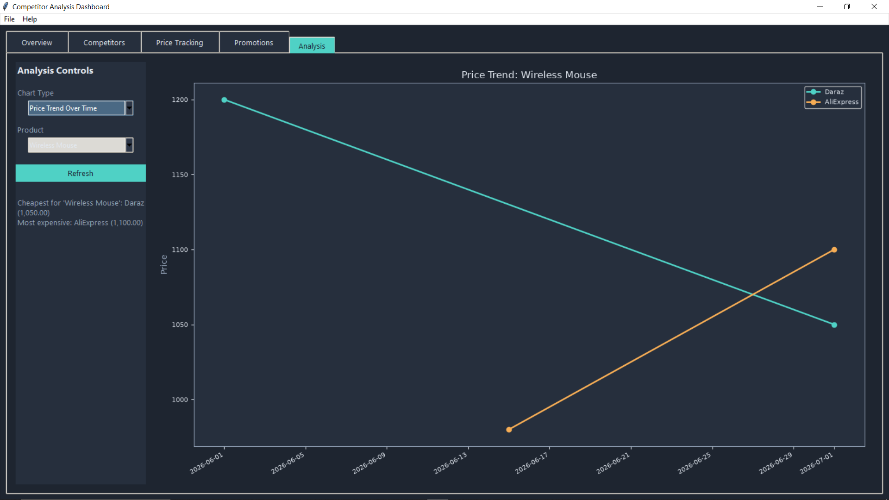
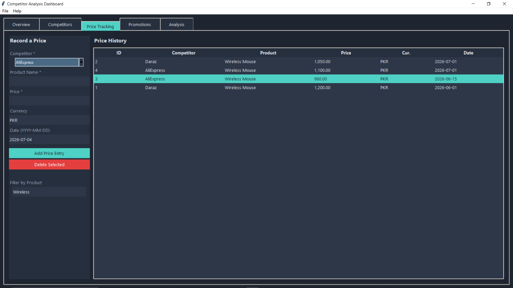

# Competitor Analysis Dashboard

A desktop GUI application built with **Python + Tkinter** for tracking competitor
pricing, promotions, and strategy over time — helping you spot price drops,
compare competitors, and see who is running the most promotions.

---

## What it does

- **Overview Dashboard** — at-a-glance summary cards (competitors tracked, products
  monitored, price points logged, active promotions) plus an auto-generated list of
  recent price movements (price increases/decreases detected automatically).
- **Competitors tab** — add, edit, and delete competitor profiles (name, website,
  category, notes).
- **Price Tracking tab** — log a price for any competitor + product on any date,
  filter price history by product, and delete bad entries.
- **Promotions tab** — log competitor promotions/campaigns (title, discount %,
  channel, start/end date) with automatic Active/Expired status tagging.
- **Analysis tab** — interactive charts (built with Matplotlib, embedded in the
  Tkinter window):
  - **Price Trend Over Time** — line chart comparing a product's price across
    competitors over time, with an auto-generated insight (cheapest/most expensive).
  - **Average Price Comparison** — bar chart of average price per competitor for a
    chosen product.
  - **Promotion Frequency** — bar chart showing which competitor runs the most
    promotions.
- **Reporting** — export a full CSV summary report (competitors, price history,
  promotions) from the File menu, and back up the underlying SQLite database.

All data is stored locally in a SQLite database (`data/competitor_data.db`), so your
data persists between runs — nothing is lost when you close the app.

---

## Project structure

```
competitor_dashboard/
├── main.py                 # App entry point, menu bar, notebook (tabs)
├── database.py              # SQLite data layer (all queries live here)
├── utils.py                  # Shared colors, fonts, small helpers
├── requirements.txt
├── data/
│   └── competitor_data.db    # Created automatically on first run
└── tabs/
    ├── overview_tab.py       # Dashboard summary + price movement alerts
    ├── competitors_tab.py    # Competitor CRUD
    ├── pricing_tab.py        # Price entry + history table
    ├── promotions_tab.py     # Promotion entry + status table
    └── analysis_tab.py       # Matplotlib charts
```

---

## How to run it

**1. Requirements:** Python 3.9+

**2. Install dependencies:**
```bash
pip install -r requirements.txt
```

> **Linux users:** Tkinter isn't bundled with Python on most Linux distros. If you
> get `ModuleNotFoundError: No module named 'tkinter'`, install it first:
> ```bash
> sudo apt-get install python3-tk
> ```
> Windows and macOS installers from python.org already include Tkinter.

**3. Run the app:**
```bash
python main.py
```

The app opens with 5 tabs: **Overview**, **Competitors**, **Price Tracking**,
**Promotions**, and **Analysis**. A SQLite database is created automatically in
`data/competitor_data.db` the first time you run it — no setup required.

**Suggested first run:**
1. Go to **Competitors** → add 2–3 competitors (e.g. "Daraz", "AliExpress").
2. Go to **Price Tracking** → log a couple of prices for the same product across
   different dates and competitors.
3. Go to **Promotions** → log a promotion or two.
4. Go to **Overview** and **Analysis** to see the dashboard and charts update live.

---

## Screenshots






---

## How AI was used

Claude was used to help plan the application architecture (SQLite schema, tab
structure, file layout), generate the initial Tkinter/Matplotlib boilerplate code,
and debug issues while building. All design decisions — what data to track, how the
tabs should be organized, what the price-change and promotion-frequency logic should
do — were made and understood by me before accepting the generated code, per the
"you MAY use AI to learn, debug, and explain, but design and understand the logic
yourself" rule.

---

## Notes / possible extensions

- Currently price-change detection compares only the two most recent entries per
  competitor/product pair. This could be extended to a rolling trend over N entries.
- Promotion "channel" and "category" fields are free text; a dropdown of standard
  values could be added for stricter data entry.
- Charts currently cover trend, comparison, and frequency — a market-share or
  discount-depth chart could be added as a further enhancement.
